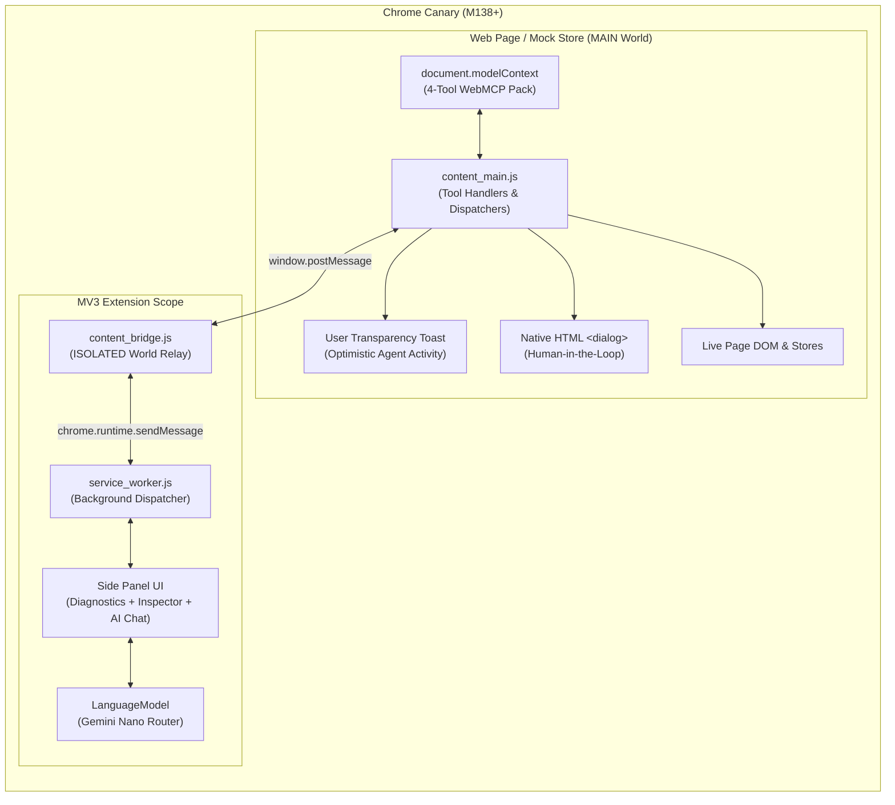

# 🛠️ Master Dry-Run Coding Playbook: WebMCP & Built-in AI Companion
**A Complete Engineering Specification for Building, Testing, and Evaluating the Workshop Extension**

> **How to Use This Document**:  
> Pass or reference this document (`WEBMCP_DRY_RUN_PLAYBOOK.md`) directly in a new coding agent conversation. It contains the complete architectural blueprints, production file tree, exact code specifications, local mock test environment, and automated eval scripts needed to code and test the entire solution end-to-end as a dry run.

---

## 1. Project Goal & Core Architecture

Build a production-grade, zero-external-dependency **Manifest V3 Chrome Extension** and **Mock Test Store** that bridges:
1. **WebMCP (`document.modelContext`)**: Native client-side JavaScript tools exposed by the web page to browser agents.
2. **Chrome Built-in AI (`globalThis.LanguageModel` / Gemini Nano)**: On-device LLM reasoning using structured output (`responseConstraint`).
3. **Dual Execution Mode (Zero-Blocker Fallback)**:
   * **AI Autonomous Mode**: Prompts routed through on-device Gemini Nano to select and execute tools.
   * **Manual Inspector Mode**: 1-click execution buttons in the Side Panel allowing immediate testing even if on-device model download is pending!
4. **Governed Browser Actuation & HITL**: React-safe DOM input dispatchers, non-intrusive on-screen user activity toasts, and native HTML `<dialog>` modals for high-stakes actions (`event.isTrusted === true`).



---

## 2. Updated Architectural Principles (Incorporating gTech CUJ Takeaways)

1. **Avoid the "API-First" Trap**:
   * WebMCP tools are **client-side JavaScript functions** running in the active tab context. They directly manipulate client state stores (Redux, Zustand, Vue) and the DOM. They are NOT thin REST wrappers that leave the browser screen blank ("Ghost Browser").
2. **The "1-Click Rule"**:
   * Do not build tools for simple actions taking $\le 1$ mouse click (e.g. "open cart"). Target complex, multi-constraint planning scenarios (e.g. *"Find waterproof running shoes under 8,000 JPY with 4+ stars and filter size 27.5"*).
3. **Minimum Tool Coverage (The Cohesive 4-Tool Pack)**:
   * Avoid "vibe-coded unit tests". Every web application integration must provide:
     1. `search_catalog` / `discover_items`: Filtered search with token-budgeted pagination (`page_size: 10`) and facet summaries ($\le 1.5$ KB).
     2. `get_item_details`: Deep inspection of an entity by ID without dumping raw DOM.
     3. `stage_action` / `add_to_cart`: Mutating action that updates the cart badge and renders immediate visual feedback.
     4. `navigate_to`: Semantic view transition / routing fallback.
4. **Pop-up & Interstitial Immunity**:
   * WebMCP tools execute programmatically on `document.modelContext`, completely bypassing marketing pop-ups, cookie banners, or modal overlays that break visual screen-scraping agents.
5. **User Transparency & Execution Feedback**:
   * When any tool executes, the page displays a subtle floating toast (`[WebMCP Agent] Executed search_catalog for "running shoes"...`) so the human user always knows what the agent is doing on their screen.
6. **Graceful Error Recovery Strings**:
   * Never throw uncaught exceptions or return empty payloads. Return actionable guiding strings that allow the AI agent to recover (e.g. `"No items found under 3,000 JPY. Try increasing the price limit or removing filters."`).
7. **Official WebMCP Tool Quality Standards (`webmcp-tool-evaluator`)**:
   * **Action-Oriented Verb-Noun Naming**: Use clear, semantic names (`search_catalog`, `add_to_cart`). Strictly `snake_case` or `camelCase`. **Never use `kebab-case` or vague names like `submit`**.
   * **Execution vs. Redirection**: Distinguish immediate execution (`add_to_cart`) from initiation/form opening (`open_cart_drawer`).
   * **Positive Phrasing & Preconditions**: State what the tool does, preconditions (e.g. *"Must be on catalog view"*), side-effects, and UI return expectations.
   * **Zero Agent Math & Natural Language Enums**: Accept raw inputs without requiring agent calculation. Use natural strings (`tier="Express"`) rather than numeric keys (`shipping_id=1`).
   * **Loose Schema Constraints**: Business validation belongs in tool code returning recovery errors, not in overly strict regexes.
8. **Mandatory Chrome DevTools MCP Live Verification**:
   * Never rely on static code review or theoretical assumptions. Every dry run must be actively driven, automated, and confirmed using `chrome-devtools` MCP server tools against a live browser instance running on `--remote-debugging-port=9222`.

---


## 3. Complete File Scaffold to Implement

The new coding conversation should generate all of the following files in a clean directory (e.g., `webmcp-agent-dryrun/`):

```text
webmcp-agent-dryrun/
├── manifest.json                  # Manifest V3 configuration
├── service_worker.js              # Background service worker (side panel launcher & relay)
├── sidepanel/
│   ├── sidepanel.html             # Diagnostic Card + Tool Inspector + AI Chat Console
│   ├── sidepanel.css              # Modern Web Guidance responsive styles & CSS variables
│   └── sidepanel.js               # LanguageModel session manager & manual test runner
├── content/
│   ├── content_main.js            # MAIN World: document.modelContext registration, React-safe input dispatcher, HITL, Toast
│   └── content_bridge.js          # ISOLATED World: postMessage <-> chrome.runtime relay
├── test_page/
│   └── mock_shop.html             # Standalone, runnable test store (Zero external dependencies)
├── evals/
│   └── webmcp_eval.js             # Automated 5-point evaluation suite (Kasper Kulikowski standard)
└── README.md                      # Setup, Chrome Canary flags, and dry-run verification guide
```

---

## 4. Detailed File-by-File Specifications

### A. `manifest.json` (Manifest V3)
```json
{
  "manifest_version": 3,
  "name": "WebMCP Agent Companion",
  "version": "1.0.0",
  "description": "WEC Partner Summit: Native WebMCP Tool Registry & Gemini Nano Actuation Companion",
  "permissions": [
    "sidePanel",
    "activeTab",
    "scripting"
  ],
  "host_permissions": [
    "<all_urls>"
  ],
  "background": {
    "service_worker": "service_worker.js"
  },
  "side_panel": {
    "default_path": "sidepanel/sidepanel.html"
  },
  "action": {
    "default_title": "Open WebMCP Agent Panel"
  },
  "content_scripts": [
    {
      "matches": ["<all_urls>"],
      "js": ["content/content_main.js"],
      "run_at": "document_idle",
      "world": "MAIN"
    },
    {
      "matches": ["<all_urls>"],
      "js": ["content/content_bridge.js"],
      "run_at": "document_idle",
      "world": "ISOLATED"
    }
  ]
}
```

---

### B. `service_worker.js`
* Configures single-click side panel launch:
  ```javascript
  chrome.sidePanel
    .setPanelBehavior({ openPanelOnActionClick: true })
    .catch((err) => console.error('[WebMCP SW] Panel behavior error:', err));
  ```
* Listens to messages from `content_bridge.js` and forwards them to active sidepanel instances via `chrome.runtime.sendMessage()`.

---

### C. `content/content_main.js` (MAIN World)
Must execute directly in the page's execution context (`"world": "MAIN"`).
Key responsibilities:
1. **Model Context Shim & Native Detection**:
   * If `document.modelContext` is not present (e.g. flag not yet enabled), initialize a resilient in-memory polyfill map with `.registerTool()`, `.getTools()`, and `.executeTool()` so execution never crashes.
2. **React/Vue Controlled Input Dispatcher**:
   ```javascript
   function setControlledInputValue(inputEl, value) {
     const nativeSetter = Object.getOwnPropertyDescriptor(window.HTMLInputElement.prototype, 'value')?.set;
     if (nativeSetter) {
       nativeSetter.call(inputEl, value);
     } else {
       inputEl.value = value;
     }
     inputEl.dispatchEvent(new Event('input', { bubbles: true }));
     inputEl.dispatchEvent(new Event('change', { bubbles: true }));
   }
   ```
3. **User Transparency Toast Injector**:
   * Injects a floating container (`#webmcp-toast-container`) with modern styles.
   * Displays temporary toasts: `showAgentToast(toolName, actionSummary)`.
4. **Human-In-The-Loop (HITL) `<dialog>` Confirmation for Consequential Actions**:
   * Any tool flagged with `consequentialHint: true` (e.g. `initiate_checkout`, booking, payment) performs high-stakes, irreversible, or real-world actions.
   * Renders a native HTML `<dialog id="webmcp-hitl-modal">` and calls `.showModal()`.
   * Enforces that the execution promise only resolves if confirmed by a genuine user gesture (`event.isTrusted === true`).
5. **The 4-Tool WebMCP Pack Registration (`ToolAnnotations` Standard)**:
   Starting in Chrome 154+, `ToolAnnotations` includes `readOnlyHint`, `consequentialHint`, and `untrustedContentHint`:
   * `search_catalog({ query, max_price, category, page })`:
     * Annotations:
       ```javascript
       annotations: {
         readOnlyHint: true,
         consequentialHint: false,
         untrustedContentHint: false
       }
       ```
     * Populates search box on page, triggers search, updates UI, and returns paginated JSON summary.
   * `get_item_details({ item_id })`:
     * Annotations:
       ```javascript
       annotations: {
         readOnlyHint: true,
         consequentialHint: false,
         untrustedContentHint: false
       }
       ```
     * Returns structured specs for an item without dumping raw DOM HTML.
   * `add_to_cart({ item_id, quantity })`:
     * Annotations:
       ```javascript
       annotations: {
         readOnlyHint: false,
         consequentialHint: false,
         untrustedContentHint: false
       }
       ```
     * Mutating action, but low stakes. Increments cart badge, updates cart drawer, shows agent toast, returns confirmed cart state without blocking modal.
   * `initiate_checkout({ coupon_code })`:
     * Annotations:
       ```javascript
       annotations: {
         readOnlyHint: false,
         consequentialHint: true,     // Signals agent/host that explicit user confirmation is mandatory!
         untrustedContentHint: false
       }
       ```
     * High-Stakes Tier 3 action. Triggers on-page HITL `<dialog>` modal requiring trusted human authorization (`event.isTrusted === true`).
6. **Bridge Synchronization**:
   * Whenever tools are registered or changed, dispatches:
     ```javascript
     window.postMessage({
       type: 'WEBMCP_TOOLS_UPDATED',
       tools: (await document.modelContext.getTools()).map(t => ({
         name: t.name,
         description: t.description,
         inputSchema: t.inputSchema || t.parameters,
         annotations: t.annotations
       }))
     }, '*');
     ```
   * Listens for `window.addEventListener('message')` to execute tools triggered from the Side Panel.

---

### D. `content/content_bridge.js` (ISOLATED World)
1. Listens for `WEBMCP_TOOLS_UPDATED` messages from `content_main.js` via `window.addEventListener('message')`.
2. Relays tools to the extension background/sidepanel via `chrome.runtime.sendMessage({ type: 'TAB_TOOLS_CHANGED', tools })`.
3. Listens for `EXECUTE_TOOL_FROM_PANEL` messages from `chrome.runtime.onMessage` and forwards them to `content_main.js` via `window.postMessage`.

---

### E. `sidepanel/sidepanel.html`, `sidepanel.css`, and `sidepanel.js`
The Side Panel is the master control center:
1. **Card 1: Pre-Flight Diagnostics**:
   * **Chrome Version**: Verified $\ge 138$.
   * **WebMCP API**: "Native (`document.modelContext`)" or "Polyfill Mode".
   * **Gemini Nano (`LanguageModel`)**: `"readily"` (Ready), `"after-download"` (Downloading), or `"unavailable"`.
2. **Card 2: Discovered Tools & Manual Test Inspector**:
   * Lists all tools registered on the active tab.
   * Displays tool name, description, parameters, and dynamic safety badges derived from `annotations`:
     * 🟢 `Tier 1: Read-Only` (`readOnlyHint: true`)
     * 🟡 `Tier 2: Mutating` (`readOnlyHint: false, consequentialHint: false`)
     * 🔴 `Tier 3: Consequential (HITL Required)` (`consequentialHint: true`)
   * **Consequential Safety Interceptor**: If the user or agent triggers a tool with `consequentialHint: true`, the Side Panel surfaces a prominent confirmation warning before dispatching.
   * **1-Click "Test Run" Button**: Allows the developer to test each tool directly with sample inputs—guaranteeing 100% testability even when offline or without Gemini Nano.
3. **Card 3: AI Co-Browsing Console (Prompt API)**:
   * Input box for natural language instructions (e.g. *"Find running shoes under 10,000 JPY and add them to cart"*).
   * Calls `globalThis.LanguageModel.create()` with a system prompt and tool definitions.
   * Displays live reasoning log: User Prompt ➡️ Agent Thought ➡️ Tool Call ➡️ DOM Execution Result.

---

### F. `test_page/mock_shop.html` (Zero-Dependency Test Playground)
A clean, self-contained HTML page designed to test all 4 tools immediately:
* Header with Title, Search Bar (`#search-input`), Category Filter select, and Cart Badge (`#cart-count`).
* Responsive Product Grid featuring items with prices, tags, and "Add to Cart" buttons.
* Cart Modal and Checkout Modal (`<dialog>`).
* Serves as the default playground when loaded via `file://` or local dev server.

---

### G. `evals/webmcp_eval.js` (Automated Evaluation Suite & CUJ Autoevals)
Integrates Chrome DevRel evaluation standards (Kasper Kulikowski) and Google3 WebMCP Autoevals rubrics (Daniel R. Smith):

#### 1. In-Browser 5-Point Runtime Assertions:
1. **Assertion 1: Tool Discovery**: Confirms active page has registered all 4 essential tools (`search_catalog`, `get_item_details`, `add_to_cart`, `initiate_checkout`).
2. **Assertion 2: Schema & Annotations Compliance (`webmcp-tool-evaluator`)**:
   * Validates `inputSchema` parameter types and ensures `snake_case` naming.
   * Asserts `ToolAnnotations` members:
     * `search_catalog`: `readOnlyHint: true, consequentialHint: false`
     * `add_to_cart`: `readOnlyHint: false, consequentialHint: false`
     * `initiate_checkout`: `readOnlyHint: false, consequentialHint: true`
3. **Assertion 3: Execution Accuracy & Token Budget**: Executes `search_catalog` and verifies returned payload is valid JSON, contains pagination metadata, and is $\le 1.5$ KB.
4. **Assertion 4: UI/DOM Synchronization**: Verifies that calling `add_to_cart` actually changed `#cart-count` in the DOM and rendered the agent toast.
5. **Assertion 5: Consequential Action & Security Boundary**: Verifies that calling `initiate_checkout` (`consequentialHint: true`) opened the native `<dialog>` modal and did not proceed without human authorization (`event.isTrusted === true`).

#### 2. Autoeval Standards for Agent Benchmarking (`webmcp-cuj-evaluator`):
* **Evaluator Separation**:
  * **LLM-as-a-Judge**: Evaluates `[Golden] Required Answers` against final verbal response and visual screenshots on a Likert scale (`FULLY_COMPLETE`). **Never prescribe internal tool names, APIs, or button clicks in the Golden Answer.**
  * **Programmatic Trace Checker**: Evaluates `TOOLS: golden_trajectory` using the generic scoped syntax (e.g. `webmcp#search_catalog, webmcp#add_to_cart`).
* **11 Core CUJ Quality Checks**:
  1. *Schema Alignment*: Trajectory matches target tool schemas; empty for Regression/Ambiguous.
  2. *Zero-Shot Context*: Grounded in immediate visible page state without conversational pronouns ("they").
  3. *Variable Isolation*: Relative temporal offsets, no ephemeral world trivia ("Super Bowl").
  4. *Distractor Immunity*: Benign conversational fluff ignored in golden outcome contracts.
  5. *State Change Restraint*: Read-only queries must never mutate cart, dates, or filters.
  6. *Pure Outcome Contract*: Describe final goal state achieved, never internal tools called.
  7. *Contract Formatting*: Bulleted checklist for compound queries, declarative prose for simple.
  8. *Trajectory Determinism*: No runtime conditional branching causing false negative trace scores.
  9. *Tool Naming & Scoping*: Strict `snake_case`/`camelCase` and `webmcp#<tool_name>` syntax.
  10. *Environment Feasibility*: Stateless browser profiles starting on catalog/product pages, never `/cart` or `/checkout`.
  11. *Standard 9-Column Format*: Difficulty levels strictly `Basic`, `Medium`, or `Difficult`.

---

## 5. Chrome Canary Configuration & Remote Debugging Setup

To enable native WebMCP testing, on-device Gemini Nano, and Chrome DevTools MCP automation:
1. **Configure Chrome Canary Flags (`chrome://flags`)**:
   * `#enable-webmcp-testing` ➡️ **Enabled**
   * `#prompt-api-tool-use` ➡️ **Enabled**
   * `#prompt-api` ➡️ **Enabled**
2. **Launch Chrome Canary with Remote Debugging (Port 9222)**:
   Launch Chrome Canary from the terminal with the remote debugging port and the unpacked extension loaded:
   ```bash
   google-chrome-canary \
     --remote-debugging-port=9222 \
     --load-extension=/google/src/cloud/synakim/saleab_26_aug/webmcp-agent-dryrun \
     --no-first-run \
     --user-data-dir=/tmp/chrome-canary-webmcp-profile &
   ```
   *(Note: If flags are not enabled or model download is in progress, the extension's built-in polyfill and manual inspector ensure full functionality for coding and verification).*

---

## 6. Mandatory Chrome DevTools MCP Live Testing Protocol

Every coding agent executing this dry run **MUST** actively connect to the running browser instance using the `chrome-devtools` MCP server tools to verify live runtime behavior. **Do NOT rely on hypothetical claims or static file checks.**

### Required Testing Workflow via `chrome-devtools` MCP:

1. **Connection Verification**:
   * Call `list_pages` on `chrome-devtools`.
   * Confirm the browser is connected on `http://127.0.0.1:9222`.
2. **Navigate to Test Page**:
   * Call `navigate_page` or `new_page` with:
     `file:///google/src/cloud/synakim/saleab_26_aug/webmcp-agent-dryrun/test_page/mock_shop.html`
3. **Verify WebMCP Tool Discovery & Execution via Script Evaluation**:
   * Call `evaluate_script` to check `document.modelContext`:
     ```javascript
     (async () => {
       const tools = await document.modelContext.getTools();
       return tools.map(t => t.name);
     })()
     ```
   * Confirm all 4 tools (`search_catalog`, `get_item_details`, `add_to_cart`, `initiate_checkout`) are returned.
4. **Execute the Automated 5-Point Evaluation Suite**:
   * Read `evals/webmcp_eval.js` and pass its contents to `evaluate_script`.
   * Verify the returned evaluation report: all 5 assertions must report `passed: true` (`score: "5/5"`).
5. **Inspect Live Console Logs**:
   * Call `list_console_messages` to verify that tool executions, timing metrics, and floating toast notifications were logged without uncaught exceptions.
6. **Capture Visual State Confirmation**:
   * Call `take_screenshot` after executing `add_to_cart` and `initiate_checkout` to capture the floating User Transparency Toast and native `<dialog>` HITL modal.

---

## 7. Exact Prompt to Launch the New Conversation

Copy and paste the following prompt when starting the new coding conversation:

```text
Please read the attached master specification: WEBMCP_DRY_RUN_PLAYBOOK.md

We are building, dry-running, and verifying the complete WebMCP Built-in AI Chrome Extension and local test environment for our Google Partner Summit technical workshop.

You must:
1. Implement the complete, production-ready code for all 8 files in the project tree:
   - manifest.json (Manifest V3 with sidePanel, activeTab, MAIN & ISOLATED content scripts)
   - service_worker.js (Side panel launcher & multi-hop message relay)
   - content/content_main.js (MAIN World: document.modelContext 4-tool pack, React-safe input dispatcher, User Transparency Toast, HITL native <dialog>)
   - content/content_bridge.js (ISOLATED World: bidirectional relay between window.postMessage and chrome.runtime)
   - sidepanel/sidepanel.html, sidepanel.css, and sidepanel.js (Diagnostic Card, Discovered Tools Inspector with 1-click test buttons, and Gemini Nano LanguageModel co-browsing chat)
   - test_page/mock_shop.html (Self-contained, runnable mock shopping page with zero external dependencies)
   - evals/webmcp_eval.js (Automated 5-point evaluation test runner verifying discovery, schema, DOM synchronization, and HITL security)
   - README.md (Setup, Chrome Canary flags, and dry-run verification guide)

2. MANDATORY LIVE TESTING:
   You MUST connect to Chrome using Chrome DevTools MCP (via port 9222) and actively execute the testing protocol specified in Section 6:
   - Navigate to mock_shop.html
   - Evaluate document.modelContext tool registration
   - Run evals/webmcp_eval.js live and confirm a 5/5 pass score
   - Verify console logs and capture screenshots of DOM actuation and HITL dialogs
   
Under no circumstances should you declare the dry run complete without real, live verification results from Chrome DevTools MCP.
```

---

## 8. Authoritative References (Google3 & Chromium)

* **WebMCP Tool Quality Evaluator (Daniel R. Smith)**:  
  `https://source.corp.google.com/piper///depot/google3/experimental/users/danielrsmith/skills/webmcp-tool-evaluator/SKILL.md`
* **WebMCP CUJ & Autoeval Evaluator (Daniel R. Smith)**:  
  `https://source.corp.google.com/piper///depot/google3/experimental/users/danielrsmith/skills/webmcp-cuj-evaluator/SKILL.md`
* **Official Chrome WebMCP Best Practices**:  
  `https://developer.chrome.com/docs/ai/webmcp/best-practices`
* **Bluebird / Bluedog Autoevals Program & Calibration**:  
  `go/blue-autoevals` & `go/blue-e2e-compositional-ar`
* **Chromium WebMCP Issue #176 (`consequentialHint`)**:  
  `https://github.com/webmachinelearning/webmcp/issues/176`


